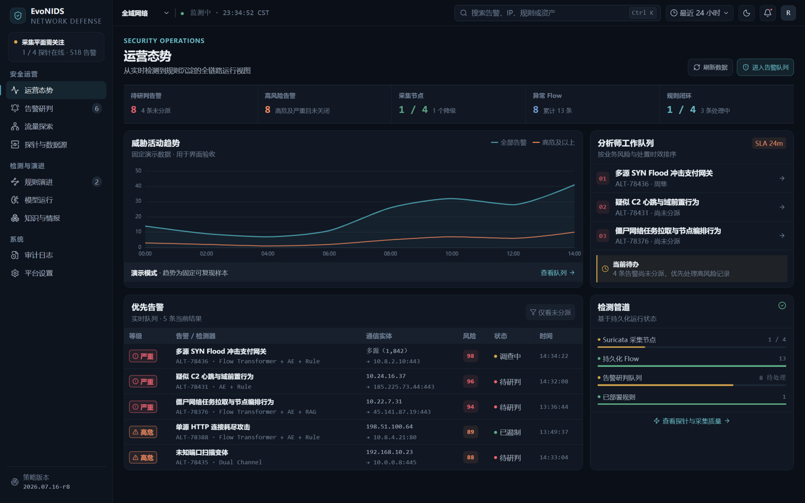
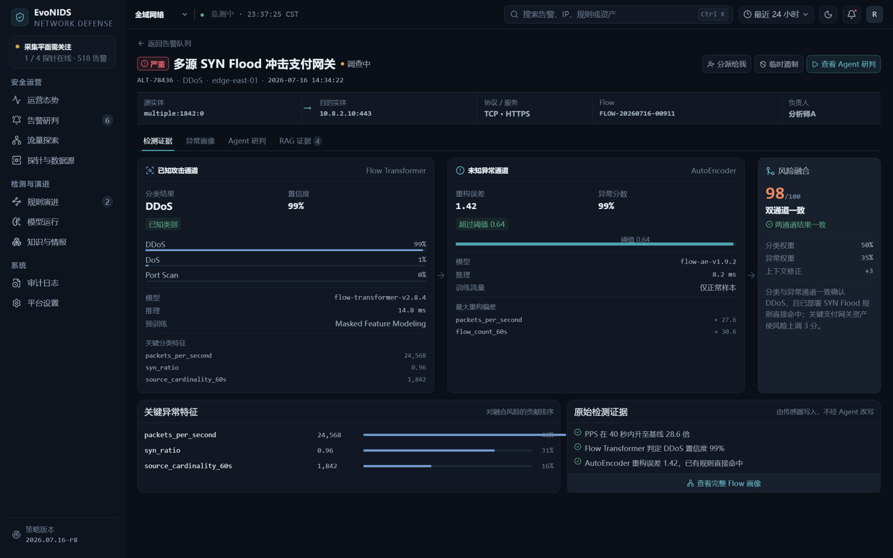
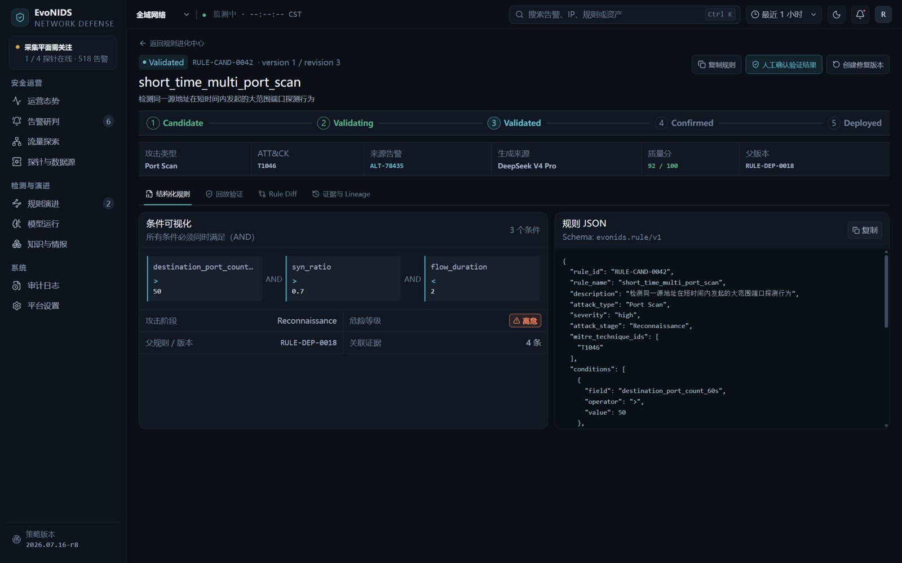
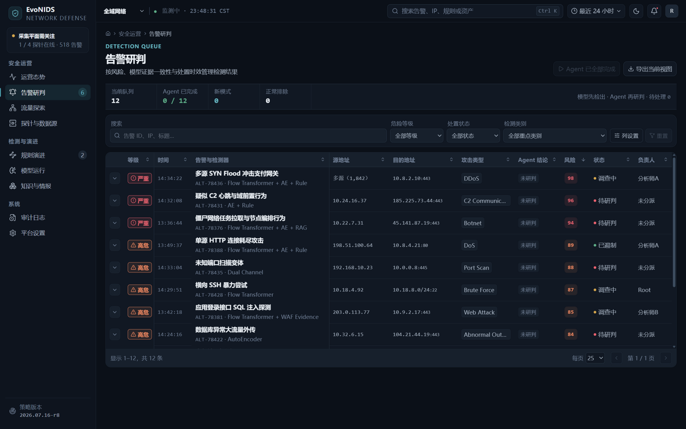
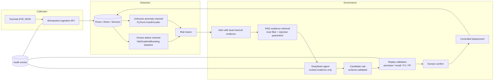

# EvoNIDS

**Evidence-driven adaptive network intrusion detection — deep dual-channel detection, explainable alerts, and LLM-generated detection rules that must earn their way into production through replay validation and human approval.**

[English](#readme) | [简体中文](README.zh-CN.md)


<!-- Replace USERNAME with your GitHub account after creating the repository: -->
[](https://github.com/USERNAME/EvoNIDS/actions)

> ⚠️ **Honesty statement** — EvoNIDS is a research/teaching system, not a production appliance. The known-attack channel currently runs a deliberately conservative **HistGradientBoosting CPU baseline** and the unknown-anomaly channel runs a **PyTorch AutoEncoder**. The target **Flow Transformer (masked feature modeling)** is planned for v0.2 and is *not* trained yet. Every simulated or degraded path in the UI is explicitly labeled — we never present mock numbers as measured ones.

---

## What is EvoNIDS?

Traditional IDS deployments face a permanent trade-off: signature rules are precise but blind to novel behavior, while anomaly detectors see the novel behavior but drown analysts in unexplained alerts. EvoNIDS closes that gap with a full governance loop:

```
dual-channel detection → evidence-backed alert → trusted RAG + LLM agent →
candidate rule → labeled-flow replay validation → human confirmation → controlled deployment
```

The LLM agent (DeepSeek, server-side only) can **propose** structured detection rules and argue from evidence — but it can never validate, confirm, or deploy them. Every candidate must beat the replay gate with measured precision/recall/F1/false-positive rate on labeled flows, and every transition is written to an immutable audit log.

### What makes it different

| Common "AI IDS" demo | EvoNIDS |
|---|---|
| LLM explains alerts in prose | LLM proposes **structured, schema-validated rule candidates** with linked evidence IDs |
| Metrics quoted from training runs | Rules pass a **replay gate with measured precision / recall / F1 / FP rate** before approval |
| Vector DB waving | Retrieval honestly reports `keyword_fallback` until a vector pipeline exists |
| One black-box score | **Dual-channel** known-attack classifier + unknown-anomaly autoencoder with transparent risk fusion |
| Silent mock data | Mock mode is explicitly labeled "演示模式"; every real number is traceable to a dataset digest and model artifact SHA-256 |
| Prompt injection hope | Untrusted knowledge text is **quarantined** by marker detection and never reaches the agent context |

## Screenshots

| Operations overview | Alert investigation |
|---|---|
|  |  |

| Rule evolution & validation | Alert queue |
|---|---|
|  |  |

*(Screenshots show the labeled mock demo dataset.)*

## Architecture



Planned (not implemented yet, see [Roadmap](#roadmap)): Flow Transformer with MFM self-supervised pretraining, hybrid vector + keyword retrieval, inference during ingestion, real-time capture, durable training job queue.

## Quickstart

### 1. Zero-config UI demo (no backend, no keys)

```bash
cd project
corepack pnpm install
corepack pnpm dev
# open http://localhost:3000/overview
```

Mock mode is the default (`NUXT_PUBLIC_USE_MOCK_API !== 'false'`): deterministic demo data, honestly labeled in the UI.

### 2. Real backend + console (SQLite, seeded demo)

```powershell
# terminal 1 — backend
cd backend
py -3.11 -m venv .venv
.\.venv\Scripts\Activate.ps1
python -m pip install -e ".[dev,ml]"
Copy-Item .env.example .env
alembic upgrade head
python .\scripts\seed_demo.py     # one labeled attack flow, an alert, a candidate rule, mixed-trust evidence
uvicorn app.main:app --reload     # http://127.0.0.1:8000/docs
```

```bash
# terminal 2 — console in real mode
cd project
NUXT_PUBLIC_USE_MOCK_API=false corepack pnpm dev
```

Windows users can also run the one-command demo: `.\start-demo.ps1` from the repo root (ephemeral in-memory tokens, nothing written to disk).

### 3. Docker Compose (PostgreSQL stack)

```bash
cp .env.example .env    # fill in tokens; DeepSeek values optional
docker compose up --build
# Nuxt: http://localhost:3000 · FastAPI docs: http://localhost:8000/docs
```

### 4. Optional: live DeepSeek agent

Add to the **uncommitted** root `.env` (the demo launcher imports only these three):

```dotenv
NUXT_DEEPSEEK_API_BASE=https://api.deepseek.com/v1
NUXT_DEEPSEEK_API_KEY=sk-...
NUXT_DEEPSEEK_MODEL=deepseek-chat
```

With a key configured, "运行 Agent 研判" on an alert produces a validated analysis **plus a schema-checked candidate rule proposal** (conditions restricted to the versioned feature whitelist) that you can save as a candidate and walk through the replay → confirm → deploy lifecycle. Without a key, everything else keeps working.

## The rule evolution loop

1. Dual-channel models score flows; fusion produces an alert with per-channel evidence.
2. The analyst opens the alert: known-attack probabilities, reconstruction error, deviating features, raw sensor facts — each visually separated as fact / model inference / agent suggestion.
3. RAG retrieves knowledge evidence with trust levels; prompt-injection-like records stay visible for review but never enter the agent context.
4. The DeepSeek agent returns hypothesis, pattern decision (`new_pattern` / `rule_variant` / `known_match` / `benign`) and — for new patterns — a **structured rule proposal** whose conditions may only use fields from the versioned feature schema, with values grounded in the observed profile.
5. "存为候选规则" persists the proposal as a `candidate` (source: `agent`). The agent cannot do this itself.
6. Replay validation evaluates the rule against labeled flows and persists measured precision, recall, F1 and false-positive rate.
7. Only after validation does **human confirmation** unlock deployment; every step lands in the audit log, and deployed rules can be deprecated and repaired as new versions.

## Measured results (CPU-only training)

Full numbers and methodology: [MODEL_CARD.md](MODEL_CARD.md). Highlights on the derived CICIDS2017 pcap-flow dataset (reproducible pipeline, fixed seed):

**Known-attack channel — HistGradientBoosting baseline (per-class test metrics, excerpt):**

| Class | Precision | Recall | F1 | Support |
|---|---|---|---|---|
| PortScan | 1.000 | 1.000 | 1.000 | 24,030 |
| DoS slowloris | 0.991 | 0.999 | 0.995 | 1,023 |
| FTP-Patator | 0.992 | 1.000 | 0.996 | 594 |
| SSH-Patator | 0.992 | 0.995 | 0.993 | 370 |
| Infiltration | 0.883 | 0.959 | 0.920 | 10,102 |
| Web Attack – Brute Force | 0.851 | 0.822 | 0.836 | 202 |
| Heartbleed | 0.000 | 0.000 | 0.000 | 1 |

**Unknown-anomaly channel — PyTorch AutoEncoder (40 epochs, ~16 min CPU):** AUROC **0.9042**, AUPRC **0.9189**, operating threshold F1 0.423 at 5.00% normal FPR; near-perfect recall on Heartbleed (10/10) and 74% on Infiltration — the classes the supervised baseline struggles with — which is exactly the complementary behavior the dual-channel design is built on.

## What's real vs simulated

| Capability | Status |
|---|---|
| EVE ingestion, sensor registry, heartbeats, audit log, rule lifecycle, replay validation, dataset registry + profiler, HGB training pipeline, AutoEncoder training, dual-channel backfill inference, agent-run persistence | ✅ Real, persisted, auditable |
| Agent analysis + candidate rule proposal | ✅ Real (requires DeepSeek key; server-side only) |
| Knowledge retrieval | ⚠️ Keyword fallback (honestly labeled); vector index planned |
| Detection during ingestion | ⚠️ Via backfill script today; inline inference planned |
| Flow Transformer / MFM pretraining | 🚧 Planned v0.2 (no GPU used in v0.1) |
| Console pages without backend/mock agent data | 🔎 Explicitly labeled demo mode |

## Repository layout

```
backend/     FastAPI service, SQLAlchemy models, Alembic migrations, training & evaluation scripts
project/     Nuxt 4 console (pages, components) + Nitro BFF (server/) + shared Zod contracts (shared/)
docs/        architecture, ADRs, learning notes
MODEL_CARD.md / DATA_CARD.md   honest model & dataset documentation
```

## Documentation

- [Architecture](docs/architecture.md) · [Operations guide](docs/operations.md)
- [Model Card](MODEL_CARD.md) · [Data Card](DATA_CARD.md)
- [Contributing](CONTRIBUTING.md) · [Security policy](SECURITY.md) · [Changelog](CHANGELOG.md)

## Security & privacy notes

- DeepSeek credentials and admin/sensor tokens are **server-side only**; the browser never sees them. `.env` is git-ignored — commit only the templates.
- EVE ingestion is capped (10 MiB per file), rejects malformed lines individually, and deduplicates by event identity. Outside development, sensor and admin tokens are mandatory.
- Untrusted knowledge text is quarantined by prompt-injection marker detection before it can reach the agent; agent evidence IDs are validated against the trusted subset on the server.
- The demo dataset is the public CICIDS2017 research capture — no real organizational traffic. See [DATA_CARD.md](DATA_CARD.md).

## Roadmap

- **v0.2** — Flow Transformer (masked feature modeling pretraining + supervised fine-tune) benchmarked against the shipped HGB baseline under the identical split protocol; hybrid vector retrieval; inline inference during ingestion.
- **v0.3** — durable training/validation job queue, UNSW-NB15 cross-dataset evaluation, multi-sensor federation.
- **v0.4** — concept drift monitoring, active-learning sample queue, pluggable model providers.

## Citation

If you use EvoNIDS in research or teaching, please cite [CITATION.cff](CITATION.cff):

```bibtex
@software{Root_EvoNIDS_2026,
  author  = {Root},
  title   = {EvoNIDS: Evidence-Driven Adaptive Network Intrusion Detection System},
  year    = {2026},
  version = {0.1.0},
  url     = {https://github.com/USERNAME/EvoNIDS}
}
```

## Acknowledgements

- [CICIDS2017](https://www.unb.ca/cic/datasets/ids-2017.html) — Canadian Institute for Cybersecurity, UNB
- [Suricata](https://suricata.io) — EVE JSON format and rule ecosystem
- [DeepSeek](https://api-docs.deepseek.com/) — LLM provider used by the rule-evolution agent

## License

[MIT](LICENSE) © 2026 Root
