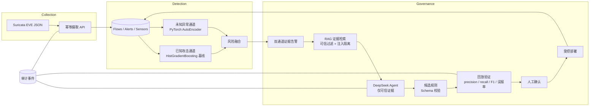

# EvoNIDS

**证据驱动的自适应网络入侵检测系统——双通道深度检测、可解释告警，以及必须通过回放验证与人工审批才能上线的大模型生成检测规则。**

[English](README.md) | [简体中文](#evonids)


[](https://github.com/RootTuring0524/EvoNIDS/actions)

> ⚠️ **诚实性声明**——EvoNIDS 是研究/教学系统，不是生产级安全设备。已知攻击通道当前运行刻意保守的 **HistGradientBoosting CPU 基线**，未知异常通道运行 **PyTorch AutoEncoder**；目标架构 **Flow Transformer（掩码特征建模）规划于 v0.2，尚未训练**。界面中每一条模拟或降级路径都有明确标注——我们从不把 Mock 数字包装成实测结果。

---

## EvoNIDS 是什么？

传统 IDS 有一个无解的取舍：特征规则精准但对未知行为失明，异常检测能看到未知行为却用无法解释的告警淹没分析师。EvoNIDS 用一条完整的治理闭环来弥合这个缺口：

```
双通道检测 → 证据化告警 → 可信 RAG + LLM Agent →
候选规则 → 标注流回放验证 → 人工确认 → 受控部署
```

LLM Agent（DeepSeek，仅服务端）可以**提出**结构化检测规则并引用证据论证——但它永远无权验证、确认或部署。任何候选规则必须先在标注流回放中以实测 precision / recall / F1 / 误报率击败验证门，每一次状态迁移都写入不可变审计日志。

### 与常见"AI IDS"的区别

| 常见演示 | EvoNIDS |
|---|---|
| LLM 用散文解释告警 | LLM 提出经过 **Schema 校验的结构化规则候选**，并绑定证据 ID |
| 指标抄训练报告 | 规则先过**回放验证门**，用实测 precision / recall / F1 / 误报率说话 |
| 空喊向量库 | 在向量管线落地前，检索诚实标注 `keyword_fallback` |
| 一个黑盒分数 | **双通道**已知攻击分类器 + 未知异常自编码器，融合权重透明 |
| 静默 Mock 数据 | Mock 模式明确标注"演示模式"；每个真实数字可追溯到数据集摘要与模型产物 SHA-256 |
| 祈祷没有提示注入 | 不可信知识文本经注入**标记检测强制隔离**（启发式，已知变体可绕过），叠加 Schema 校验、证据白名单与人工门禁构成纵深防御 |

## 界面截图

| 运营态势 | 告警研判 |
|---|---|
|  |  |

| 规则演进与验证 | 告警队列 |
|---|---|
|  |  |

*（截图为明确标注的 Mock 演示数据集。）*

## 架构



规划中（尚未实现，见 [路线图](#路线图)）：Flow Transformer 与 MFM 自监督预训练、向量+关键词混合检索、摄取时在线推理、实时抓包、持久化训练任务队列。

## 快速开始

### 1. 零配置界面演示（无需后端、无需密钥）

```bash
cd project
corepack pnpm install
corepack pnpm dev
# 打开 http://localhost:3000/overview
```

Mock 模式是默认值（`NUXT_PUBLIC_USE_MOCK_API !== 'false'`）：确定性演示数据，界面明确标注。

### 2. 真实后端 + 控制台（SQLite，含种子演示）

```powershell
# 终端 1 —— 后端
cd backend
py -3.11 -m venv .venv
.\.venv\Scripts\Activate.ps1
python -m pip install -e ".[dev,ml]"
Copy-Item .env.example .env
alembic upgrade head
python .\scripts\seed_demo.py     # 一条标注攻击流、一条告警、一条候选规则、混合可信证据
uvicorn app.main:app --reload     # http://127.0.0.1:8000/docs
```

```bash
# 终端 2 —— 真实模式控制台
cd project
NUXT_PUBLIC_USE_MOCK_API=false corepack pnpm dev
```

Windows 用户还可以用一键演示：仓库根目录 `.\start-demo.ps1`（内存临时令牌，不落盘）。

### 3. Docker Compose（PostgreSQL 栈）

```bash
cp .env.example .env    # 填入令牌；DeepSeek 配置可选
docker compose up --build
# Nuxt: http://localhost:3000 · FastAPI 文档: http://localhost:8000/docs
```

### 4. 可选：DeepSeek Agent 实时研判

在**未提交**的根 `.env` 中加入（一键演示脚本只会导入这三项）：

```dotenv
NUXT_DEEPSEEK_API_BASE=https://api.deepseek.com/v1
NUXT_DEEPSEEK_API_KEY=sk-...
NUXT_DEEPSEEK_MODEL=deepseek-chat
```

配置密钥后，在告警详情页点击"运行 Agent 研判"会返回通过契约校验的研判结果，**外加一个经 Schema 校验的候选规则提案**（条件字段被限制在版本化特征白名单内，取值锚定画像实际观测值），可一键存为候选规则并走完回放 → 确认 → 部署生命周期。没有密钥时，其余功能全部照常工作。

设置页提供 DeepSeek 状态面板——配置状态徽章、模型 ID、接口域名，以及真实请求上游 `/models` 的"测试连接"按钮；界面与审计中的模型显示名由配置驱动：配置了 `NUXT_DEEPSEEK_MODEL` 时显示 `DeepSeek · <model id>`，未配置时显示 DeepSeek V4 Pro。未配置 DeepSeek 时，Agent 研判会返回可操作的中文配置指引，而不是一句生硬的报错。

## 规则进化闭环

1. 双通道模型为流量打分，融合产出带分通道证据的告警。
2. 分析师打开告警：已知攻击概率、重建误差、偏离特征、原始传感器事实——事实 / 模型推断 / Agent 建议在视觉上严格分区。
3. RAG 按可信等级检索知识证据；命中注入标记的记录被强制隔离、保持可见供审查，且无法进入 Agent 上下文（检测为启发式子串规则，精心构造的变体可能绕过——结构化 Schema、证据 ID 白名单与人工门禁是后续防线）。
4. DeepSeek Agent 返回攻击假设、模式判断（`new_pattern` / `rule_variant` / `known_match` / `benign`），并且对新模式额外返回**结构化规则提案**——条件字段只能来自版本化特征 Schema，取值必须锚定画像观测值。
5. "存为候选规则"把提案落库为 `candidate`（来源：`agent`）。Agent 自己无权做这一步。
6. 回放验证在标注流上评估规则，持久化实测 precision、recall、F1 与误报率。
7. 只有验证通过后**人工确认**才会解锁部署；每一步都写入审计日志，已部署规则可废弃、可修复为新版本。

## 实测结果（纯 CPU 训练）

完整数字与方法论见 [MODEL_CARD.md](MODEL_CARD.md)。以下为 CICIDS2017 派生流数据集（可复现管线、固定种子）摘要：

**已知攻击通道——HistGradientBoosting 基线（逐类测试集指标，节选）：**

| 类别 | Precision | Recall | F1 | Support |
|---|---|---|---|---|
| PortScan | 1.000 | 1.000 | 1.000 | 24,030 |
| DoS slowloris | 0.991 | 0.999 | 0.995 | 1,023 |
| FTP-Patator | 0.992 | 1.000 | 0.996 | 594 |
| SSH-Patator | 0.992 | 0.995 | 0.993 | 370 |
| Infiltration | 0.883 | 0.959 | 0.920 | 10,102 |
| Web Attack – Brute Force | 0.851 | 0.822 | 0.836 | 202 |
| Heartbleed | 0.000 | 0.000 | 0.000 | 1 |

**未知异常通道——PyTorch AutoEncoder（40 epochs，约 16 分钟 CPU）：** AUROC **0.9042**、AUPRC **0.9189**，工作阈值下 F1 0.423、正常误报率 5.00%；对 Heartbleed（10/10）和 Infiltration（74%）召回极高——恰好是监督基线最弱的类别，这正是双通道设计所依赖的互补性。

## 真实 vs 模拟

| 能力 | 状态 |
|---|---|
| EVE 摄取、传感器注册、心跳、审计日志、规则生命周期、回放验证、数据集注册与剖析、HGB 训练管线、AutoEncoder 训练、双通道回填推理、Agent 运行持久化 | ✅ 真实、持久化、可审计 |
| Agent 研判 + 候选规则提案 | ✅ 真实（需 DeepSeek 密钥；仅服务端） |
| 知识检索 | ⚠️ 关键词回退（诚实标注）；向量索引规划中 |
| 摄取时检测 | ⚠️ 当前经回填脚本；内联推理规划中 |
| Flow Transformer / MFM 预训练 | 🚧 规划 v0.2（v0.1 未使用 GPU） |
| 无后端 / Mock Agent 数据的控制台页面 | 🔎 明确标注演示模式 |

## 仓库结构

```
backend/     FastAPI 服务、SQLAlchemy 模型、Alembic 迁移、训练与评估脚本
project/     Nuxt 4 控制台（页面、组件）+ Nitro BFF（server/）+ 共享 Zod 契约（shared/）
docs/        架构、ADR、学习笔记
MODEL_CARD.md / DATA_CARD.md   诚实的模型与数据集文档
```

## 文档

- [架构](docs/architecture.md) · [运维手册](docs/operations.md)
- [模型卡](MODEL_CARD.md) · [数据卡](DATA_CARD.md)
- [贡献指南](CONTRIBUTING.md) · [安全策略](SECURITY.md) · [变更日志](CHANGELOG.md)

## 安全与隐私

- DeepSeek 凭据与管理员/传感器令牌**仅存服务端**；浏览器永远接触不到。`.env` 已被 git 忽略——只提交模板。
- EVE 摄取有上限（单文件 10 MiB）、逐行容错、按事件身份幂等去重。开发环境之外，传感器与管理员令牌强制启用。
- 不可信知识文本在进入 Agent 之前经提示注入标记检测强制隔离（启发式，非完备防线）；Agent 的证据 ID 由服务端对照可信子集校验。
- 控制台登录认证为**可选且默认关闭**。设置 `NUXT_CONSOLE_PASSWORD` 即启用：`POST /api/auth/login` 用口令换取签名 HttpOnly 会话 Cookie（`NUXT_CONSOLE_SESSION_HOURS` 控制会话时长，默认 24 小时），此后除登录页外，所有页面与 `/api/**` BFF 路由都要求登录。
- 不设置 `NUXT_CONSOLE_PASSWORD` 时控制台保持开放——适用于本机开发与演示场景。该口令是防止"任何能访问该端口的人直接操作规则部署或训练"的最低门槛，并不能替代正式部署中的 TLS 反向代理。
- 演示数据集是公开的 CICIDS2017 研究抓包——不含任何真实组织流量。见 [DATA_CARD.md](DATA_CARD.md)。

## 路线图

- **v0.2** —— Flow Transformer（MFM 预训练 + 监督微调），在完全相同的切分协议下与已发布的 HGB 基线对比；向量混合检索；摄取时内联推理。
- **v0.3** —— 持久化训练/验证任务队列、UNSW-NB15 跨数据集评估、多传感器联邦。
- **v0.4** —— 概念漂移监测、主动学习样本队列、可插拔模型 Provider。

## 引用

在研究或教学中使用 EvoNIDS 请引用 [CITATION.cff](CITATION.cff)：

```bibtex
@software{Root_EvoNIDS_2026,
  author  = {Root},
  title   = {EvoNIDS: Evidence-Driven Adaptive Network Intrusion Detection System},
  year    = {2026},
  version = {0.1.0},
  url     = {https://github.com/RootTuring0524/EvoNIDS}
}
```

## 致谢

- [CICIDS2017](https://www.unb.ca/cic/datasets/ids-2017.html) — 加拿大网络安全研究所（UNB）
- [Suricata](https://suricata.io) — EVE JSON 格式与规则生态
- [DeepSeek](https://api-docs.deepseek.com/) — 规则演进 Agent 所用的 LLM 服务

## 许可证

[MIT](LICENSE) © 2026 Root
