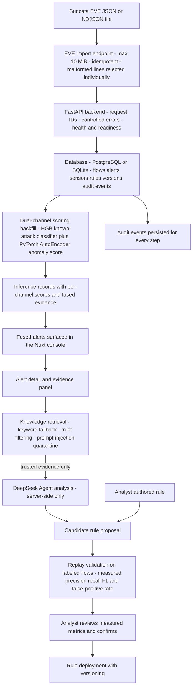

# EvoNIDS Architecture — v0.1 (as implemented)

This document describes the **currently implemented** system. Everything in the main
diagram exists in the repository today; anything not yet built is listed explicitly under
[Planned](#planned-not-yet-implemented). The known-attack channel is a
HistGradientBoosting CPU baseline; the planned Flow Transformer (MFM self-supervised
pretraining) is **not trained and not part of this architecture yet**.

## End-to-end flow

## Component responsibilities

| Component | Location | Responsibility |
|---|---|---|
| Nuxt console | `project/` | Overview, alerts, flows, rules, knowledge, model operations pages. Server routes under `project/server/api` proxy to FastAPI; DeepSeek credentials and sensor/admin tokens stay server-only and never reach the browser. |
| FastAPI backend | `backend/app` | Routers: `health`, `ingestion`, `alerts`, `flows`, `rules`, `audit`, `models`, `datasets`, `training/runs`, `rag`, `sensors`, `overview` (mounted under `/api/v1`). Request IDs, controlled errors, paginated contracts. |
| EVE ingestion | `backend/app/api/routes/ingestion.py` | `POST /api/v1/ingestion/eve` accepts up to 10 MiB of EVE JSON/NDJSON, deduplicates repeated flow and alert events, and rejects malformed lines individually instead of failing the whole file. |
| Sensor registry | `backend/app/api/routes/sensors.py` | Sensor inventory, heartbeat endpoint, derived online/degraded/offline health, accumulated ingest quality counters. |
| Known-attack channel | `backend/scripts/train_full_baseline.py`, training service `backend/app/services/training.py` | `HistGradientBoostingClassifier` CPU baseline. Training re-hashes the dataset (SHA-256 lineage), stratified 70/15/15 split, persisted validation/test metrics, digest-verified artifacts. |
| Unknown-anomaly channel | `backend/scripts/train_full_autoencoder.py`, scoring service `backend/app/services/autoencoder.py` | PyTorch tabular AutoEncoder trained on benign flows only; threshold fixed at the validation 0.95 quantile for a 5% target FPR. |
| Dual-channel scoring backfill | `backend/scripts/backfill_dual_channel_inference.py` | Scores replay flows with both channels and persists `Inference` records with per-channel results and fusion evidence. This is an offline backfill — see Planned. |
| Alert operations | `backend/app/services/alert_operations.py` | Fused alert detail, assignment/disposition, evidence assembly, Agent run contract. |
| Knowledge retrieval | `backend/app/services/knowledge_retrieval.py` | Persisted evidence with keyword retrieval. The implementation honestly reports `keyword_fallback` — vector candidates and scores stay zero until an embedding pipeline exists. Trust filtering and prompt-injection marker detection force suspicious evidence into a blocked review path. |
| Agent boundary | `project/server/api/agent/analyze.post.ts` + `backend/app/services/alert_operations.py` | DeepSeek is called server-side only; **only trusted, non-blocked evidence** crosses the boundary into the Agent contract. Agent runs are not persisted yet. |
| Rule lifecycle | `backend/app/services/rule_lifecycle.py` | Pure-Python structured rule evaluator plus lifecycle transition guard: proposal → replay validation → confirmation → deployment, with versioned rules. |
| Replay validation | labeled-flow rule replay services | Candidate rules are replayed against labeled flows and measured precision, recall, F1 and false-positive rate are persisted before confirmation. |
| Dataset registry | `backend/app/services/dataset_catalog.py` | Register datasets by relative path under `EVONIDS_DATASET_ROOT`; background profiling computes SHA-256, row count, feature count, missing values and label distribution. Dataset digest becomes immutable lineage once referenced by a training run. |
| Audit | `audit` router + audit event models | Every operation — ingestion, disposition, rule transitions, training, sensor administration — writes persisted audit events. |

## Security boundaries

- API writes are disabled unless `EVONIDS_ADMIN_API_TOKEN` is configured; sensor ingestion
  requires `EVONIDS_SENSOR_INGEST_TOKEN` outside development.
- The Nuxt server forwards `NUXT_SENSOR_INGEST_TOKEN` and DeepSeek credentials from
  server-only settings; they are never returned to the browser.
- RAG evidence marked blocked or prompt-injection-like stays visible for review but is
  never passed to the Agent.
- Mock mode (`NUXT_PUBLIC_USE_MOCK_API=true`) is explicitly labeled as a UI demonstration
  and cannot register datasets or start training.

## Planned (not yet implemented)

- **Flow Transformer with MFM self-supervised pretraining** — the target known-attack
  channel; must beat the HGB baseline under the same dataset identity and split protocol.
- **Vector and hybrid knowledge retrieval** — embeddings for RAG; today only keyword
  fallback is implemented.
- **Online inference at ingestion time** — scoring currently happens as an offline
  backfill over replayed flows, not inside the ingest path.
- **Real-time packet capture** — the only ingestion path today is EVE JSON import.
- **Persistent job queue for training and long tasks** — training runs execute in the
  FastAPI process today; jobs interrupted by a process exit are marked failed with an
  audit event until a durable queue exists.
- **Persisted Agent runs** — DeepSeek analysis is invoked on demand; runs are not stored yet.
